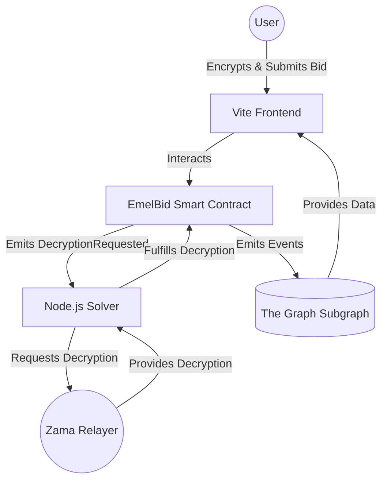

# EmelBid: Encrypted Dutch Auction Marketplace 🚀🔒

**EmelBid** is an **encrypted Dutch Auction marketplace** built using Fully Homomorphic Encryption, powered by Zama’s FHEVM. It enables users to create and participate in privacy-preserving auctions for various asset classes (ERC20, ERC721, and Confidential Tokens) where bid amounts remain completely hidden until the auction is settled.

Today, most on-chain auctions expose every bid publicly. That creates major problems like front-running, MEV exploitation, and unfair price manipulation. Anyone can monitor pending transactions and react before your bid is finalized.

EmelBid solves this by keeping bids fully encrypted on-chain.

In our Dutch auction model, the price starts high and decreases over time, and the first bidder whose encrypted bid is greater than or equal to the current price wins. The key difference is that nobody can see the actual bid amount while the auction is running — not validators, not RPC providers, and not other users.

Using Zama’s FHE technology, all bid comparisons and auction logic happen directly on encrypted data without revealing sensitive values.

---

##### Demo Link: https://emel-bid-99d5.vercel.app/

##### Demo Video: 

## 🌟 Core Features

- **Confidential Bidding**: Bids are encrypted using FHE. No one—neither the RPC node, miner, nor other bidders—can see the true bid amount before settlement.
- **Multi-Asset Support**: Create auctions for:
  - Standard **ERC20** tokens
  - Non-Fungible Tokens (**ERC721**)
  - Confidential **ERC7984** FHE tokens
- **On-Chain Encrypted Logic**: Auction price decay and winning bid determination are calculated using `FHE` operations on-chain.
- **Verifiable Decryption**: A trusted solver handles decryption requests via the Zama relayer. Winning bid details are made `publiclyDecryptable` upon settlement for transparent verification.

---

## 🏛️ System Architecture

EmelBid consists of four primary components working in sync:



1. **Smart Contracts (`/contract`)**: The core engine built with Solidty and Zama's `FHE` library. It manages auction state, encrypted bidding logic, and asset transfers.
2. **Frontend (`/frontend`)**: A React/Vite application that handles local FHE encryption, wallet interactions (Wagmi/Viem), and displays auction data via the Subgraph.
3. **Solver (`/solver`)**: A Node.js service that monitors the blockchain for decryption requests and executes the decryption fulfillment flow through the Zama relayer.
4. **Indexer (`/indexer`)**: A Subgraph that tracks auction lifecycle events to provide a performant API for the frontend to query auction history and active listings.

---

## 🛠️ Technology Stack

- **FHE Engine:** Zama FHEVM, `@zama-fhe/relayer-sdk`
- **Smart Contracts:** Solidity, Hardhat, Ethers, Chai (Testing)
- **Frontend Stack:** React, Vite, TypeScript, TailwindCSS, React Router, Wagmi
- **Backend / Solver:** Node.js, Viem, TypeScript
- **Data Indexing:** The Graph (Subgraph)
- **Network:** Ethereum Sepolia Testnet (FHEVM Coprocessor)

---

## 🔗 Deployed Contracts (Sepolia)

All functional contracts are actively deployed on the **Sepolia Testnet**.

| Contract | Address |
| --- | --- |
| **EmelBid** | `0xb452Ae94A20d618Ea8c86B1580B93D96CF0d1D10` |
| **CWETH (Confidential WETH)** | `0xe7eAF40bc2a8d8A42251ABe6BdeE34075715Ee7F` |
| **NBL (Mock ERC20)** | `0xff6acF51F397505bFc43B7E19329Fa8057B277E3` |
| **Mock ERC721 (NFTs)** | `0xE63Eb347601aBdD5bAc2476ba979baA24E3c23Fb` |
| **Mock ERC7984 (Confidential Tokens)** | `0xCcc0a189ba958B395f3676a11F2758C4EaEE2d0a` |

*Subgraph URL*: `https://api.studio.thegraph.com/query/1749160/emelbid-subgraph/version/latest`

---

## 🚀 Getting Started

### Prerequisites

- Node.js (>= 18.x)
- npm or yarn
- MetaMask (or another Web3 provider) with Sepolia Testnet configured.

### 1. Smart Contracts
```bash
cd contract
npm install
# Compile contracts and generate typings
npx hardhat compile
# Run the test suite
npx hardhat test
```

### 2. Solver (Decryption Bot)
The solver must be running for auctions to settle properly.
```bash
cd solver
npm install
# Configure your .env file with PRIVATE_KEY and RPC endpoints
cp .env.example .env
# Run the solver script
npm run dev
```

### 3. Frontend App
Ensure the FHE configurations and ABI endpoints reflect the latest deployed contract (`CONTRACTS.EMEL_BID`).
```bash
cd frontend
npm install
npm run dev
```
Open `http://localhost:3000` to interact with EmelBid!

---

## 🔐 How the EmelBid Decryption Engine Works

1. **Placing a Bid:** A buyer locally encrypts `bidAmount` into an `euint64` FHE handle and pushes it on-chain via `placeBid`.
2. **On-chain Action:** `EmelBid.sol` links the encrypted bid to the current auction instance and fires a `DecryptionRequested` event.
3. **Bot Observation:** The `/solver` node service detects the event. It interacts with the decentralized Zama Relayer to attempt decryption.
4. **Resolution:** The solver posts the result back to `fulfillDecryption()`, finalizing whether the bid successfully crossed the decay price.
5. **Transparency Check:** Winning bids emit their `requestId` out to a global mapping. The platform exposes a `fhevm.publicDecrypt([isWinningHandle, bidAmountHandle])` process that viewers can use in the frontend to mathematically prove exactly who won and how much they paid.

---

## 📄 License
This project is open-source. Please see the associated LICENSE file for details.
